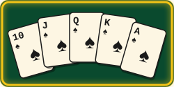
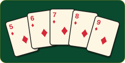
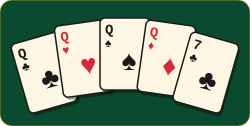
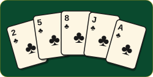
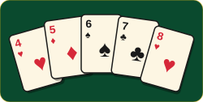

  
  
  

## 👑 Player Card

## ♠ The Hand So Far

## ♦ Showdown: Hand Rankings

> Six projects, ranked like poker hands. The best hand is at the top.

<table>
<tr>
<td width="260" align="center" valign="middle">
 
<b>👑 Royal Flush</b> the nuts
</td>
<td valign="top">

### [PolicySim: Labour-Market ABM at Scale](https://github.com/adityamenonnn/policysim-mesa)
`Python` `Mesa` `NumPy` `pandas`

Agent-based simulation of UK AI-driven job displacement. Each agent's `step()` is collapsed into one vectorised NumPy multiply with a row-wise softmax, and the model is calibrated on 8 merged UK labour datasets (a 255 × 166 quarterly panel). Includes scaling benchmarks, a feedback-loop analysis and a policy sweep.

**Scales to 1M agents · 17.57 ms mean tick at 100K · near-linear to 300K**

</td>
</tr>
<tr>
<td width="260" align="center" valign="middle">
 
<b>♦ Straight Flush</b> one card short of perfect
</td>
<td valign="top">

### [RAG with a Real Evaluation Harness](https://github.com/adityamenonnn/Requests-Library-RAG-With-Evaluation)
`Python` `ChromaDB` `sentence-transformers` `Groq / Llama 3.1`

A retrieval-augmented Q&amp;A system over the Python `requests` docs. Retrieval and generation are scored separately (Hit Rate@k, MRR, LLM-as-judge), trap questions test whether it refuses instead of hallucinating, and a chunk-size ablation comes with a written failure analysis.

**100% Hit Rate@3 · 0.931 MRR · 4.12/5 judge score · 0% hallucination on trap questions**

</td>
</tr>
<tr>
<td width="260" align="center" valign="middle">
 
<b>♣ Four of a Kind</b> quads, and the blocks stack themselves
</td>
<td valign="top">

### [Tetris AI: Lookahead Search + Genetic Algorithm](https://github.com/adityamenonnn/tetris)
`Python` `Tkinter` `curses` `sockets`

An autonomous agent that scores placements on a multi-feature heuristic (holes, bumpiness, wells, transitions, danger zone) with two-piece lookahead, and uses bombs and discards tactically. A from-scratch GA with tournament selection, uniform crossover, Gaussian mutation and elitism evolves the weights. No ML libraries.

**Up to 1,600 board states per move · +34% average score over baseline across 700 seeds**

</td>
</tr>
<tr>
<td width="260" align="center" valign="middle">
 
<b>♥ Full House</b> hardware + firmware + cloud, all filled
</td>
<td valign="top">

### [Integrated Bioreactor for TB Vaccine Production](https://github.com/adityamenonnn/Integrated-Bioreactor)
`C/C++` `ESP32` `MQTT` `ThingsBoard` `scikit-learn`

A team-built modular ESP32 controller with independent pH, stirring and heating subsystems. It streams telemetry to ThingsBoard over MQTT and accepts remote setpoints through shared attributes and RPC. Anomaly detection runs on the sensor data.

**±0.4 °C stability · 500–1500 RPM held within ±20 · 98% single-fault detection (One-Class SVM)**

</td>
</tr>
<tr>
<td width="260" align="center" valign="middle">
 
<b>♠ Flush</b> every card the same suit: clean OOP
</td>
<td valign="top">

### [Patient Data App](https://github.com/adityamenonnn/COMP0004-Patient-Data-App)
`Java` `OOP`

A patient-records application built for UCL's COMP0004 module, focused on object-oriented design: clean class structure, encapsulation, and separating data handling from presentation.

**UCL COMP0004 coursework**

</td>
</tr>
<tr>
<td width="260" align="center" valign="middle">
 
<b>♣ Straight</b> where the run started
</td>
<td valign="top">

### [Facial Recognition](https://github.com/adityamenonnn/Facial-Recognition)
`Python` `OpenCV`

My first computer-vision project. It detects faces in a live video feed with Haar cascades, captures a personal face dataset, and recognises known faces in real time.

**The first card in the sequence**

</td>
</tr>
</table>

## ♣ Chip Count

